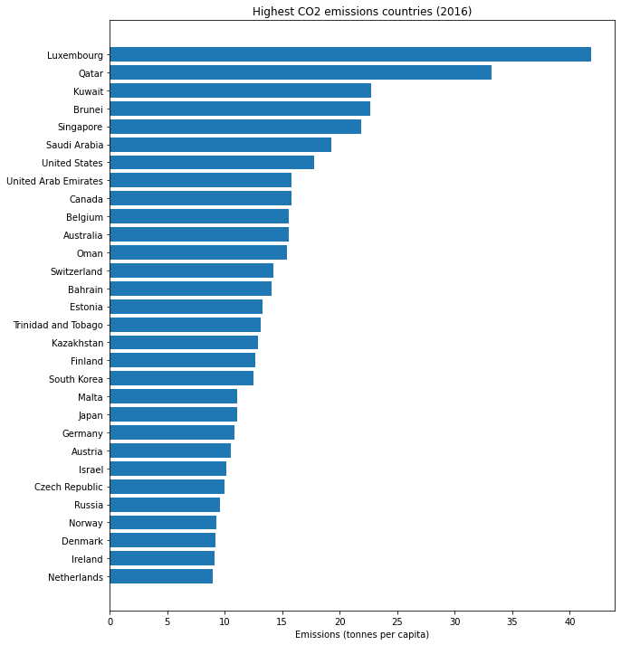
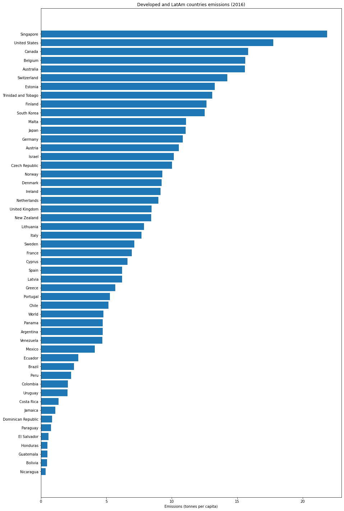
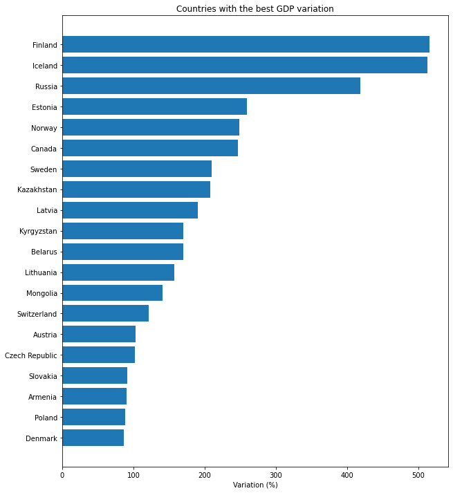
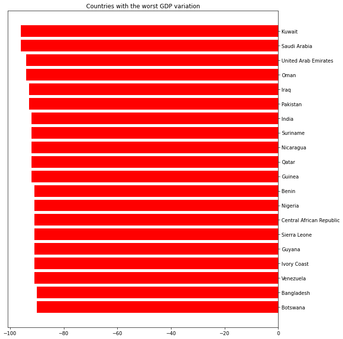
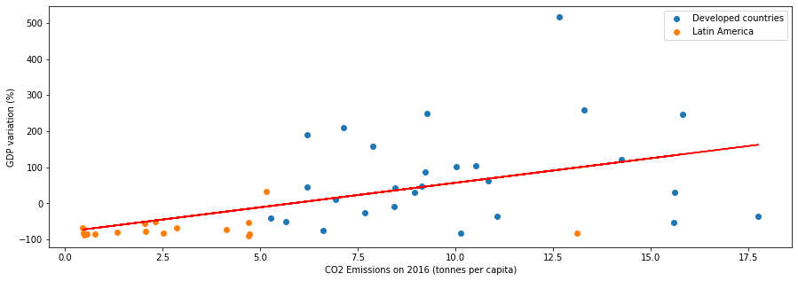

```python
%matplotlib inline
import pandas as pd
import numpy as np
import matplotlib.pyplot as plt
```

# CO$_{2}$ emissions per capita besed on consuption

### Countries that polute the most


```python
#get the coutries emissions
ghg = pd.read_csv('ghg_emissions.csv')
countries = ghg.Country.to_list()
countries = countries[:30]
emissions = ghg.Emissions.to_list()
emissions = emissions[:30]

#graphic plot
plt.figure(figsize=(10, 12))
plt.barh(countries, emissions)
plt.gca().invert_yaxis()
plt.title('Highest CO2 emissions countries (2016)')
plt.xlabel('Emissions (tonnes per capita)')
plt.show()
```


    

    


### A comparison between developed countries and Latin America


```python
comp = pd.read_csv('dev_and_latin.csv')
del comp['index']
comp.set_index('Country', inplace=True)
comp = comp.drop(comp.index[0]) #removed Luxembourg because is too high (>40)

plt.figure(figsize=(15, 25))
plt.barh(comp.index, comp.Emissions, align="center")
plt.gca().invert_yaxis()
plt.title('Developed and LatAm countries emissions (2016)')
plt.xlabel('Emissions (tonnes per capita)')
plt.show()
```


    

    


### Map of emissions


```python
import geopandas as gpd
import json
from bokeh.io import output_notebook, show
from bokeh.plotting import figure
from bokeh.models import GeoJSONDataSource, LinearColorMapper, ColorBar, HoverTool
from bokeh.palettes import brewer
```


```python
#load map shapefiles
shapefile = './/ne_110m_admin_0_countries/ne_110m_admin_0_countries.shp'
gdf = gpd.read_file(shapefile)[['ADMIN', 'ADM0_A3', 'geometry',]]
gdf.columns = ['country', 'country_code', 'geometry']
gdf = gdf.drop(gdf.index[159]) #remove antarctica
```


```python
df = pd.read_csv('to_map.csv')
merged = gdf.merge(df, left_on='country', right_on='Country')
merged_json = json.loads(merged.to_json())
json_data = json.dumps(merged_json)
geosource = GeoJSONDataSource(geojson = json_data)
palette = brewer['OrRd'][8]
palette = palette[::-1]
tick_labels = {'20': '>20'}
color_mapper = LinearColorMapper(palette = palette, low = 0, high = 20)
color_bar = ColorBar(color_mapper=color_mapper, label_standoff=8,width = 500, height = 20,
border_line_color=None,location = (0,0), orientation = 'horizontal', major_label_overrides = tick_labels)
hover = HoverTool(tooltips = [ ('Country/region','@country'),('Tons per capita', '@Emissions')])
p = figure(title = 'Consumption-based emissions in 2016 (tonnes per capita)', plot_height = 600 , plot_width = 950, toolbar_location = None, tools = [hover])
p.xgrid.grid_line_color = None
p.ygrid.grid_line_color = None
p.patches('xs','ys', source = geosource,fill_color = {'field' :'Emissions', 'transform' : color_mapper},
          line_color = 'black', line_width = 0.25, fill_alpha = 1)
p.add_layout(color_bar, 'below')
output_notebook()
show(p)
```


<div class="bk-root">
    <a href="https://bokeh.org" target="_blank" class="bk-logo bk-logo-small bk-logo-notebook"></a>
    <span id="1031">Loading BokehJS ...</span>
</div>


<div class="bk-root" id="9ddecfd8-7c8c-425c-80e4-12297faba40c" data-root-id="1005"></div>


# Predicted GDP variation by 2100 due to climate change

### Positive GDP variations


```python
gdp = pd.read_csv('gdp.csv')
gdp["GDP"] = 100 * gdp["GDP"]
countries_name = gdp.Country.to_list()
countries_name_high = countries_name[:20]
countries_gdp = gdp.GDP.to_list()
countries_gdp_high = countries_gdp[:20]

plt.figure(figsize=(10, 12))
plt.barh(countries_name_high, countries_gdp_high)
plt.gca().invert_yaxis()
plt.title('Countries with the best GDP variation')
plt.xlabel('Variation (%)')
plt.show()
```


    

    


### Negative GDP variations


```python
countries_name_low = countries_name[-20:]
countries_gdp_low = countries_gdp[-20:]

plt.figure(figsize=(10, 12))
plt.barh(countries_name_low, countries_gdp_low, color='r')
plt.gca().yaxis.tick_right()
plt.title('Countries with the worst GDP variation')
plt.show()
```


    

    


### GDP variation map


```python
#load data
df = pd.read_csv('to_map.csv')
df["GDP"] = round(100 * df["GDP"], 0)
merged = gdf.merge(df, left_on='country', right_on='Country') #merge the gdp data with map df
#put data on geojson
merged_json = json.loads(merged.to_json())
json_data = json.dumps(merged_json)
geosource = GeoJSONDataSource(geojson = json_data)
#map settings
palette = brewer['RdBu'][9]
palette = palette[::-1]
tick_labels = {'100': '>100'}
color_mapper = LinearColorMapper(palette = palette, low = -100, high = 100)
color_bar = ColorBar(color_mapper=color_mapper, label_standoff=8,width = 500, height = 20,
border_line_color=None,location = (0,0), orientation = 'horizontal', major_label_overrides = tick_labels)
hover = HoverTool(tooltips = [ ('Country/region','@country'),('GDP variation', '@GDP %')])
p = figure(title = 'GDP variation by 2100', plot_height = 600 , plot_width = 950, toolbar_location = None, tools = [hover])
p.xgrid.grid_line_color = None
p.ygrid.grid_line_color = None
p.patches('xs','ys', source = geosource,fill_color = {'field' :'GDP', 'transform' : color_mapper},
          line_color = 'black', line_width = 0.25, fill_alpha = 1)
p.add_layout(color_bar, 'below')
output_notebook()
show(p)
```


<div class="bk-root">
    <a href="https://bokeh.org" target="_blank" class="bk-logo bk-logo-small bk-logo-notebook"></a>
    <span id="1116">Loading BokehJS ...</span>
</div>


<div class="bk-root" id="4f712bef-7c45-4f8b-96b6-7e09ac824148" data-root-id="1090"></div>


# A comparison between GHG source and consequence


```python
dev = pd.read_csv('gdp_comp_dev.csv', index_col='Country')
dev["GDP"] = 100 * dev["GDP"]
latin = pd.read_csv('gdp_comp_latin.csv', index_col='Country')
latin["GDP"] = 100 * latin["GDP"]
df1 = pd.read_csv('gdp_comp.csv')
df1["GDP"] = 100 * df1["GDP"]
plt.figure(figsize=(15, 5))
plt.subplot()
plt.scatter(dev.Emissions, dev.GDP)
plt.scatter(latin.Emissions, latin.GDP)
z = np.polyfit(df1.Emissions, df1.GDP, 1)
p = np.poly1d(z)
plt.legend(['Developed countries', 'Latin America'])
plt.plot(df1.Emissions, p(df1.Emissions), "r")
plt.ylabel('GDP variation (%)')
plt.xlabel('CO2 Emissions on 2016 (tonnes per capita)')
plt.show()
```


    

    


```python
df1.corr()
```


<div>
<style scoped>
    .dataframe tbody tr th:only-of-type {
        vertical-align: middle;
    }

    .dataframe tbody tr th {
        vertical-align: top;
    }

    .dataframe thead th {
        text-align: right;
    }
</style>
<table border="1" class="dataframe">
  <thead>
    <tr style="text-align: right;">
      <th></th>
      <th>Emissions</th>
      <th>GDP</th>
    </tr>
  </thead>
  <tbody>
    <tr>
      <th>Emissions</th>
      <td>1.000000</td>
      <td>0.501204</td>
    </tr>
    <tr>
      <th>GDP</th>
      <td>0.501204</td>
      <td>1.000000</td>
    </tr>
  </tbody>
</table>
</div>


### As we can see, the majority of countries that polute the most will also have better GDP variation with climate change. Altough there is a 0.5 correlation, it doesn't fully explain causality. Developed countries are reponsible for the majority of emissions per capita, therefore they are richer and can have a better time facing climate change, but a factor that help them is the geographic location, the north will be less affected than the tropics. But still, some of the developed countries that contributes the most to climate change will suffer less than those with low emissions in latin america.


```python

```
